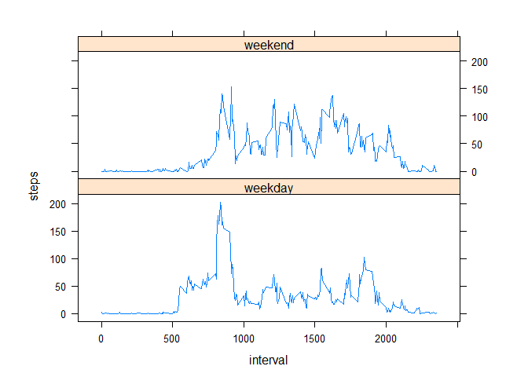

# Reproducible Research: Peer Assessment 1 - Zarmeen Nasim
## Introduction

It is now possible to collect a large amount of data about personal
movement using activity monitoring devices such as a
[Fitbit](http://www.fitbit.com), [Nike
Fuelband](http://www.nike.com/us/en_us/c/nikeplus-fuelband), or
[Jawbone Up](https://jawbone.com/up). These type of devices are part of
the "quantified self" movement -- a group of enthusiasts who take
measurements about themselves regularly to improve their health, to
find patterns in their behavior, or because they are tech geeks. But
these data remain under-utilized both because the raw data are hard to
obtain and there is a lack of statistical methods and software for
processing and interpreting the data.

This assignment makes use of data from a personal activity monitoring
device. This device collects data at 5 minute intervals through out the
day. The data consists of two months of data from an anonymous
individual collected during the months of October and November, 2012
and include the number of steps taken in 5 minute intervals each day.

## Data

The data for this assignment can be downloaded from the course web
site:

* Dataset: [Activity monitoring data](https://d396qusza40orc.cloudfront.net/repdata%2Fdata%2Factivity.zip) [52K]

The variables included in this dataset are:

* **steps**: Number of steps taking in a 5-minute interval (missing
    values are coded as `NA`)

* **date**: The date on which the measurement was taken in YYYY-MM-DD
    format

* **interval**: Identifier for the 5-minute interval in which
    measurement was taken


The dataset is stored in a comma-separated-value (CSV) file and there
are a total of 17,568 observations in this
dataset.

## Loading and preprocessing the data

```r
data <- read.csv("activity/activity.csv")
dim(data)
```

```
## [1] 17568     3
```

```r
head(data)
```

```
##   steps       date interval
## 1    NA 2012-10-01        0
## 2    NA 2012-10-01        5
## 3    NA 2012-10-01       10
## 4    NA 2012-10-01       15
## 5    NA 2012-10-01       20
## 6    NA 2012-10-01       25
```
## What is mean total number of steps taken per day?

```r
steps_data <- aggregate(steps ~ date, data=data, sum, na.rm = TRUE)
hist(steps_data$steps, main = paste("Total Steps Each Day"), col="blue", xlab="Number of Steps")
```


## What is the average daily activity pattern?

```r
steps_interval <- aggregate(steps ~ interval, data, mean)
plot(steps_interval$interval,steps_interval$steps, type="l", xlab="Interval", ylab="Number of Steps",main="Average Number of Steps per Day by Interval")
```


```r
max_interval <- steps_interval[which.max(steps_interval$steps),1]
print(paste("The maximum number of steps in a five minute interval was: ", max_interval))
```

```
## [1] "The maximum number of steps in a five minute interval was:  835"
```

## Imputing missing values

```r
imputed_data <- data
imputed_data$steps[is.na(imputed_data$steps)] <- median(data$steps, na.rm=TRUE)

head(imputed_data)
```

```
##   steps       date interval
## 1     0 2012-10-01        0
## 2     0 2012-10-01        5
## 3     0 2012-10-01       10
## 4     0 2012-10-01       15
## 5     0 2012-10-01       20
## 6     0 2012-10-01       25
```

```r
steps_day_i <- aggregate(steps ~ date, imputed_data, sum)
hist(steps_day_i$steps, main = paste("Total Steps Each Day"), col="blue", xlab="Number of Steps")
```


```r
#computing mean
rawsteps_mean <- mean(data$steps, na.rm=TRUE)
rawsteps_median <- median(data$steps, na.rm=TRUE)
print(paste("The mean steps per day is: ", rawsteps_mean))
```

```
## [1] "The mean steps per day is:  37.3825995807128"
```

```r
print(paste("The median steps per day is: ", rawsteps_median))
```

```
## [1] "The median steps per day is:  0"
```

```r
bsteps_mean <- mean(imputed_data$steps)
bsteps_median <- median(imputed_data$steps)
print(paste("The mean is: ", bsteps_mean))
```

```
## [1] "The mean is:  32.4799635701275"
```

```r
print(paste("The median is: ", bsteps_median))
```

```
## [1] "The median is:  0"
```

## Are there differences in activity patterns between weekdays and weekends?

```r
imputed_data$date <- as.Date(imputed_data$date)
imputed_data$dayname <- weekdays(imputed_data$date)
imputed_data$weekend <- as.factor(ifelse(imputed_data$dayname == "Saturday" |                                                                  imputed_data$dayname == "Sunday", "weekend", "weekday"))
library(lattice)
plotdata <- aggregate(steps ~ interval + weekend,imputed_data, mean)
xyplot(steps ~ interval | factor(weekend), data=plotdata, aspect=1/3, type="l")
```


